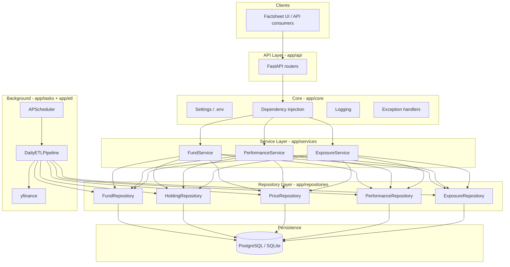
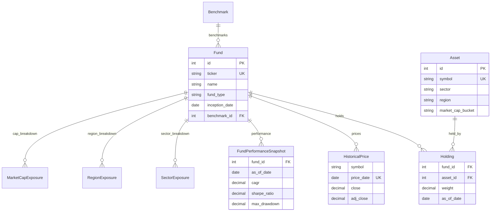

# Spring Street Prisma Backend

Financial data backend for an investment factsheet platform — fund metadata, holdings, performance analytics, exposure breakdowns, and scheduled market-data ETL.

Built with **FastAPI**, **SQLAlchemy**, **PostgreSQL** (production) / **SQLite** (local dev), **Alembic**, **yfinance**, and **APScheduler**.

**Repository:** [github.com/Toshika-Kamble/springstreet-prisma-backend](https://github.com/Toshika-Kamble/springstreet-prisma-backend)

---

## Table of Contents

- [Architecture Overview](#architecture-overview)
- [Request Flow](#request-flow)
- [Data Model](#data-model)
- [ETL & Scheduler](#etl--scheduler)
- [Project Structure](#project-structure)
- [Quick Start](#quick-start)
- [API Reference](#api-reference)
- [Configuration](#configuration)

---

## Architecture Overview

The system follows **clean, layered architecture**: HTTP handlers stay thin; business rules live in services; SQL stays in repositories; ingestion is isolated in ETL modules.



### Design principles

| Principle | How it is applied |
|-----------|-------------------|
| **Separation of concerns** | Routers → services → repositories → models |
| **Dependency injection** | FastAPI `Depends()` wires repos into services (`app/core/dependencies.py`) |
| **Repository pattern** | All SQL/query logic centralized; services stay DB-agnostic |
| **Validated I/O** | Pydantic schemas for every API response and pagination/filter params |
| **Modular ETL** | Market fetch, analytics, and exposure aggregation are separate modules |
| **Environment-based config** | `pydantic-settings` loads from `.env` (DB URL, cron, risk-free rate) |

### Layer responsibilities

```
┌─────────────┐     ┌──────────────┐     ┌────────────────┐     ┌──────────────┐
│  REST API   │────▶│   Services   │────▶│  Repositories  │────▶│   Database   │
│  (routers)  │     │  (business)  │     │  (data access) │     │ PG / SQLite  │
└─────────────┘     └──────────────┘     └────────────────┘     └──────────────┘
       │                    ▲
       │             ┌──────┴──────┐
       │             │ ETL + Tasks │
       │             │  (yfinance) │
       └─────────────┴─────────────┘
```

| Layer | Path | Responsibility |
|-------|------|----------------|
| **API** | `app/api/` | HTTP routes, query params, status codes |
| **Schemas** | `app/schemas/` | Request/response DTOs, pagination, filters |
| **Services** | `app/services/` | Orchestration, `NotFoundError`, domain rules |
| **Repositories** | `app/repositories/` | Queries, upserts, pagination |
| **Models** | `app/models/` | SQLAlchemy ORM, relationships, constraints |
| **ETL** | `app/etl/` | yfinance ingest, metrics, exposure rollups |
| **Tasks** | `app/tasks/` | APScheduler cron for daily pipeline |
| **Core** | `app/core/` | Config, logging, DI, shared exceptions |
| **Utils** | `app/utils/` | CAGR, volatility, Sharpe, drawdown math |

---

## Request Flow

Example: `GET /api/v1/funds/SPY/performance`

1. **Router** (`app/api/v1/funds.py`) receives `ticker=SPY`, injects `PerformanceService`.
2. **Service** loads the fund by ticker; raises `404` if missing.
3. **Repositories** fetch latest `FundPerformanceSnapshot`, historical snapshots, and `HistoricalPrice` rows.
4. **Schemas** map ORM objects → `FundPerformanceResponse` (validated JSON).
5. **Client** receives CAGR, Sharpe, drawdown, period returns, and price series for charts.

Exposure endpoints follow the same pattern, reading pre-aggregated `SectorExposure` / `RegionExposure` / `MarketCapExposure` tables (refreshed by ETL from holdings).

---

## Data Model

Normalized schema designed for factsheet queries and daily updates.



| Entity | Purpose |
|--------|---------|
| `Fund` | ETF/mutual fund metadata (ticker, AUM, expense ratio, benchmark link) |
| `Asset` | Underlying securities with sector, region, market-cap bucket |
| `Holding` | Fund ↔ asset weights for a given `as_of_date` |
| `HistoricalPrice` | Daily OHLCV (fund NAV or asset prices) |
| `FundPerformanceSnapshot` | Point-in-time risk/return metrics |
| `SectorExposure` / `RegionExposure` / `MarketCapExposure` | Rolled-up allocation weights |
| `Benchmark` | Index benchmarks (e.g. ^GSPC) linked to funds |

---

## ETL & Scheduler

### Daily pipeline (`app/etl/pipeline.py`)

| Step | Action |
|------|--------|
| 1 | For each active fund ticker, fetch history via **yfinance** |
| 2 | Upsert `historical_prices` |
| 3 | Compute **CAGR**, **volatility**, **Sharpe**, **max drawdown**, period returns (`app/utils/metrics.py`) |
| 4 | Upsert `fund_performance_snapshots` |
| 5 | Aggregate holdings → sector / region / market-cap exposure tables |

### Scheduler (`app/tasks/scheduler.py`)

**APScheduler** runs the pipeline daily (default **06:00 UTC**, configurable via `ETL_CRON_HOUR` / `ETL_CRON_MINUTE`). The scheduler starts with the FastAPI process and shuts down on app exit.

Manual run:

```bash
python -m scripts.run_etl
```

---

## Project Structure

```
springstreet-prisma-backend/
├── app/
│   ├── api/              # REST routers
│   │   └── v1/funds.py
│   ├── core/             # config, DI, logging, exceptions
│   ├── db/               # engine, session, Base
│   ├── models/           # SQLAlchemy ORM
│   ├── schemas/          # Pydantic DTOs
│   ├── services/         # business logic
│   ├── repositories/     # data access
│   ├── etl/              # market data & analytics pipelines
│   ├── tasks/            # APScheduler
│   └── utils/            # financial metrics
├── alembic/              # migrations
├── scripts/              # seed_data, run_etl
├── docker-compose.yml    # PostgreSQL + API
├── run.ps1               # Windows one-command setup
├── requirements.txt
└── .env.example
```

---

## Quick Start

### Windows (SQLite — no Docker/PostgreSQL)

```powershell
git clone https://github.com/Toshika-Kamble/springstreet-prisma-backend.git
cd springstreet-prisma-backend
.\run.ps1
```

- Home: http://127.0.0.1:8000/ (links + status)  
- Health: http://127.0.0.1:8000/health (HTML status page) · JSON: http://127.0.0.1:8000/health/json  
- Docs: http://127.0.0.1:8000/docs  
- Funds: http://127.0.0.1:8000/api/v1/funds  

```powershell
.\run.ps1 setup   # migrations only
.\run.ps1 seed    # migrate + seed sample data (SPY, QQQ, VTI)
.\run.ps1 etl     # fetch live prices (internet required)
.\run.ps1 dev     # start API only
```

### Docker + PostgreSQL

```bash
cp .env.example .env
# Set DATABASE_URL=postgresql+psycopg2://postgres:postgres@db:5432/prisma_factsheet
docker compose up --build
```

### Manual setup

```bash
python -m venv .venv
source .venv/bin/activate   # Windows: .venv\Scripts\activate
pip install -r requirements.txt
cp .env.example .env
alembic upgrade head
python -m scripts.seed_data
uvicorn app.main:app --reload
```

---

## API Reference

Base path: `/api/v1`

| Method | Path | Description |
|--------|------|-------------|
| GET | `/funds` | List funds (pagination, `fund_type`, `is_active`, `search`) |
| GET | `/funds/{ticker}` | Fund detail + benchmark |
| GET | `/funds/{ticker}/performance` | Metrics + price history for charts |
| GET | `/funds/{ticker}/holdings` | Latest holdings (paginated) |
| GET | `/funds/{ticker}/exposure/sectors` | Sector allocation |
| GET | `/funds/{ticker}/exposure/regions` | Geographic allocation |
| GET | `/funds/{ticker}/exposure/market-cap` | Market-cap bucket allocation |

### Examples

```bash
curl "http://localhost:8000/api/v1/funds?is_active=true"
curl "http://localhost:8000/api/v1/funds/SPY"
curl "http://localhost:8000/api/v1/funds/SPY/performance"
curl "http://localhost:8000/api/v1/funds/QQQ/holdings"
curl "http://localhost:8000/api/v1/funds/VTI/exposure/sectors"
```

---

## Configuration

Copy `.env.example` → `.env`.

| Variable | Description |
|----------|-------------|
| `DATABASE_URL` | `sqlite:///./data/prisma_factsheet.db` (dev) or PostgreSQL URL (prod) |
| `API_V1_PREFIX` | Default `/api/v1` |
| `SCHEDULER_ENABLED` | `true` / `false` |
| `ETL_CRON_HOUR` / `ETL_CRON_MINUTE` | Daily ETL time (UTC) |
| `YFINANCE_LOOKBACK_YEARS` | Price history window |
| `RISK_FREE_RATE` | Sharpe ratio input (default `0.04`) |
| `RUN_ETL_ON_SEED` | Run yfinance during seed (`false` recommended locally) |
| `LOG_LEVEL` | `INFO`, `DEBUG`, etc. |

---

## Tech Stack

| Layer | Technology |
|-------|------------|
| API | FastAPI, Pydantic v2, Uvicorn |
| ORM | SQLAlchemy 2.x |
| Database | PostgreSQL (production), SQLite (local dev) |
| Migrations | Alembic |
| Market data | yfinance |
| Scheduler | APScheduler |
| Containers | Docker Compose |

---

## License

MIT
